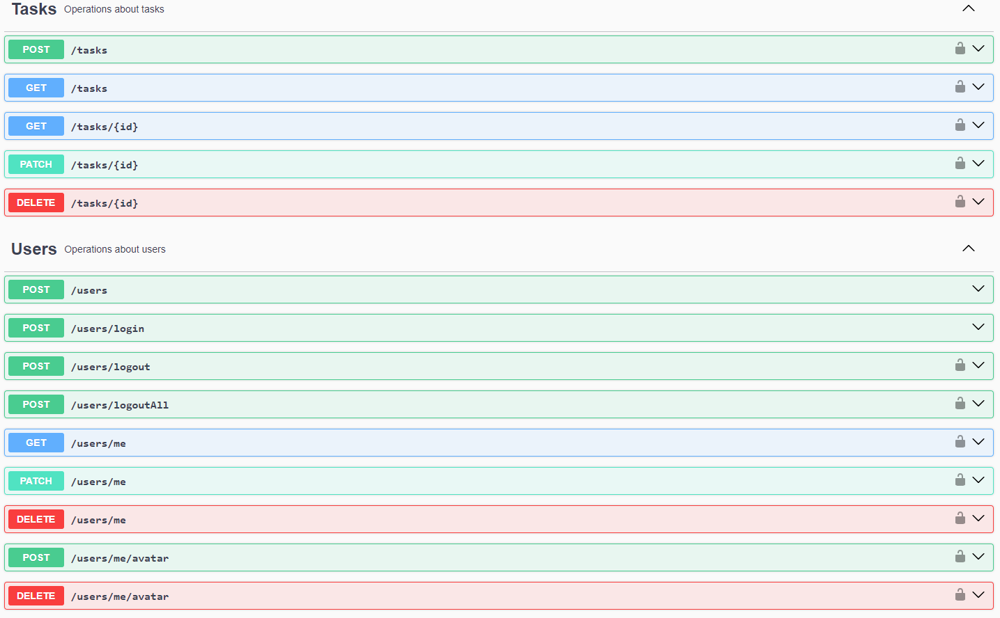

# Task manager API using NodeJS
A RESTful API that uses a MongoDB nosql database to store and retrieves information about a user and a task linked to a user. JsonWebToken is used to create an authentication middleware to protect content.

## API Docs




See full docs [here](https://petstore.swagger.io/?url=https://raw.githubusercontent.com/neluchetraru/task-manager/master/src/swagger.json)

## Tools used
- Node.JS
- express
- mongoose
- jsonwebtoken
- bcryptjs
- validator
- multer

### Environment
Set up an environment in config/dev.env
```bash
PORT=3000
MONGODB_URL=YOUR_MONGODB_URL
JWT_SECRET=YOUR_SECRET
```

### How to run in dev mode
```bash
git clone https://github.com/neluchetraru/task-manager.git && cd task-manager
npm install
npm run dev
```

### Open documentation
Now that the server is running, open http://localhost:3000/api-docs to see the swagger API docs